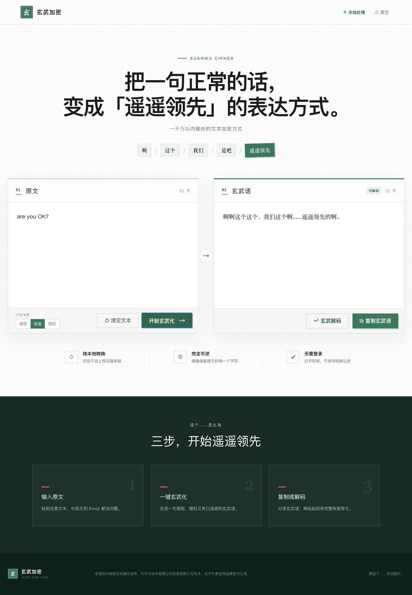
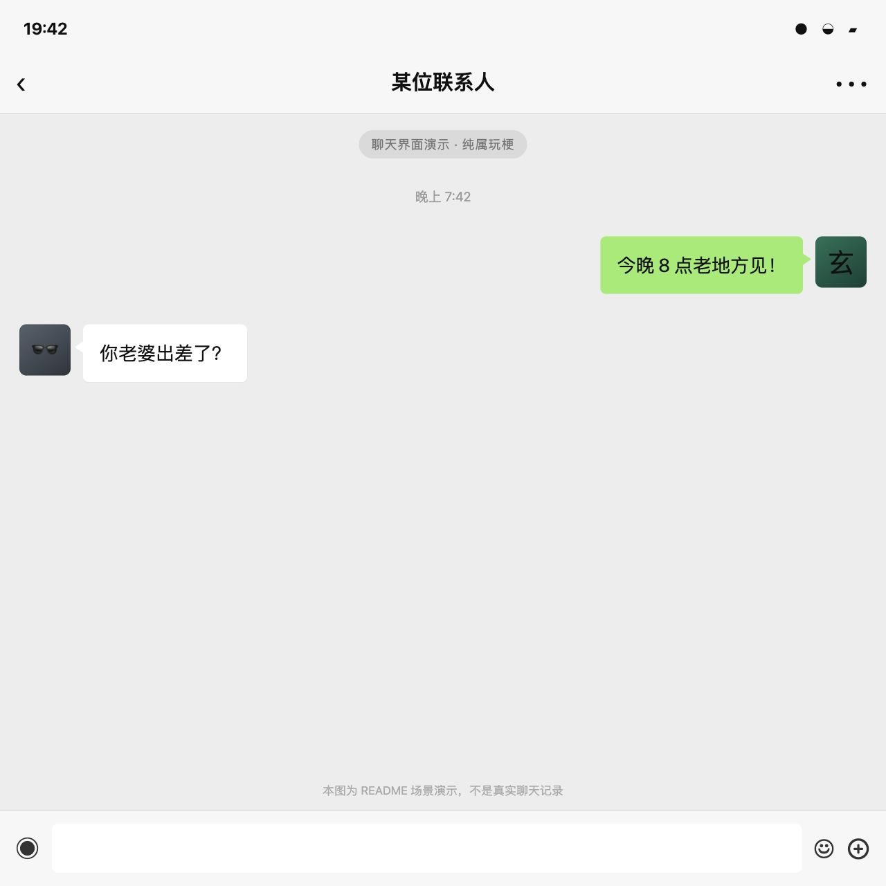
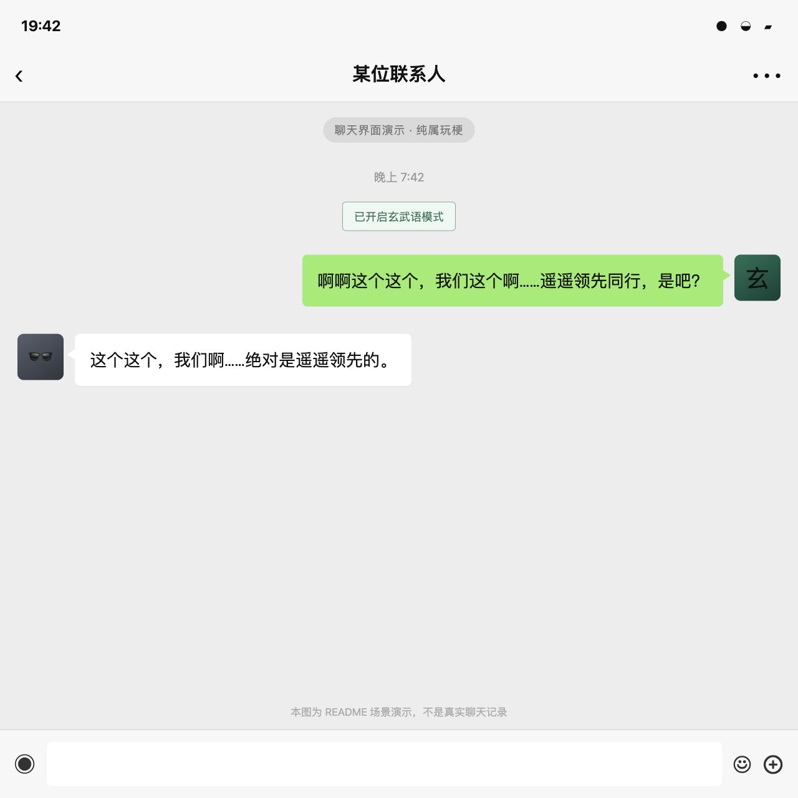

# 玄武加密 / Xuanwu Cipher

把普通文字变成一小句“啊这个……遥遥领先”的玄武语，还能随时恢复成原文。

在线体验：[xuanwu-cipher.vercel.app](https://xuanwu-cipher.vercel.app)

## 看看效果

下面的例子把 `are you OK？` 变成了玄武语：



## 这是做什么的？

玄武加密是一个好玩的文本转换工具。

你输入一句正常的话，网站会把它变成由“啊、这个、我们、是吧、遥遥领先”等词组成的短句。把生成结果完整复制回来，又可以恢复成原来的文字。

它支持中文、英文、数字、Emoji、标点和换行。例如聊天内容、段子或中英文混合文本都可以正常转换。

## 怎么使用？

1. 在左侧输入想转换的文字。
2. 选择“精简、标准、唠叨”中的一种口音。
3. 点击“开始玄武化”。
4. 点击“复制玄武语”，把结果发给别人。
5. 需要查看原文时，把完整的玄武语粘贴到右侧，再点击“玄武解码”。

注意：一定要完整复制生成结果。只照着屏幕上看得见的短句重新打一遍，无法恢复原文。

## 一个非常严肃的使用场景（并不）

比如，你想和出轨对象进行一场“加密通话”：

> 你：今晚 8 点老地方见！
> 出轨对象：你老婆出差了？

这种话直接发，多少有点过于直白。这时候就可以先用玄武加密转换一下，再把生成的玄武语发出去。

| 普通聊天 | 换成玄武语聊天 |
| --- | --- |
|  |  |

拿到玄武语的人，只要把完整内容复制回网站，就能恢复原文。再也不怕老婆查微信。

## 内容会上传吗？

不会。转换和解码都在你的浏览器里完成，网站不会上传、保存或记录输入内容。

## 它是真正的加密吗？

不是。玄武加密是网络文化娱乐项目，适合用来玩梗和转换普通文本，不适合保存密码、银行卡信息或其他敏感内容。

## 想在自己电脑上运行

先安装 [Node.js](https://nodejs.org/)，然后在项目目录执行：

```bash
npm install
npm run dev
```

浏览器打开终端里显示的本地地址即可。运行测试使用：

```bash
npm test
```

## 简单原理

页面上看见的玄武语只是“外衣”，真正用于恢复原文的数据藏在它后面的不可见 Unicode 字符里。解码时，网站读取这些隐藏数据并检查内容是否完整，所以外面的短句可以随机变化，原文仍然能够准确恢复。

## 开源许可

项目使用 [MIT License](./LICENSE)。你可以学习、修改和重新发布代码，但请保留许可证中的版权与许可说明。

## 声明

本项目为网络文化娱乐创作，与华为技术有限公司及其关联公司无关，也不代表任何品牌官方立场。

## 友链

https://linux.do/
