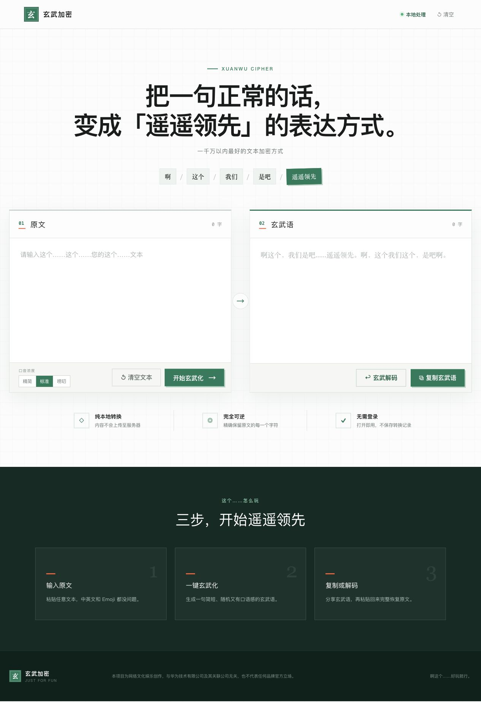

# 玄武加密 / Xuanwu Cipher

把普通文字变成一小句“啊这个……遥遥领先”的玄武语。它是一个纯本地、可逆的娱乐文本转换工具。

## 项目截图



## 特点

- 支持中文、英文、数字、Emoji、标点和换行
- 所有编码和解码都在浏览器本地完成
- 玄武语的可见部分保持为短句
- 提供“精简 / 标准 / 唠叨”三档口音
- 内置版本标记和 CRC32 完整性校验
- 兼容旧版可见词汇编码

## 工作原理

1. 将原文转换为 UTF-8 字节。
2. 加入格式版本和 CRC32 校验值。
3. 将字节映射为不可见的 Unicode 变体选择符。
4. 生成一句随机玄武口音文案作为可见载体。

可见文案和隐藏数据相互独立，因此调整口音不会破坏解码。分享时必须完整复制生成结果，手动重新输入可见短句无法恢复原文。

## 本地开发

```bash
npm install
npm run dev
npm test
```

## 使用说明

在左侧输入原文，选择喜欢的口音浓度后点击“开始玄武化”。生成的玄武语可以直接复制；把完整内容粘回右侧，再点击“玄武解码”，即可恢复原文。页面不会上传或保存输入内容。

## 声明

本项目为网络文化娱乐创作，不是真正的密码学加密，与华为技术有限公司及其关联公司无关。
